::: 你需要准备的
一台电脑
一个脑子
一个电子邮箱账号
:::

注册皮肤站
-
如果您没有LittleSkin账号，请点击[**注册账号**](https://littleskin.cn/auth/register)注册一个

  
点击查看详细内容

  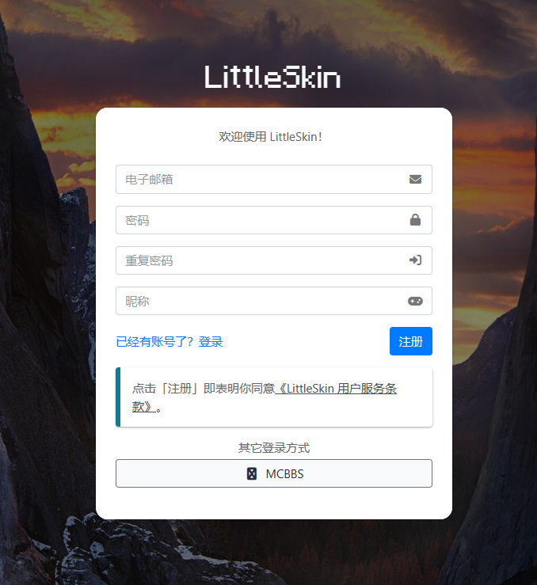

  点击左侧的**角色管理**，创建一个角色（请使用英文大小写字母、数字0~9或下划线_）

  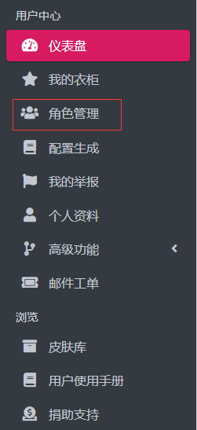

  之后您可以前往**皮肤库**寻找您喜欢的皮肤，并在**我的衣柜**里使用

  ([官方有更加详细的教程](https://manual.littlesk.in/newbee/textures.html#%E4%BB%8E%E7%9A%AE%E8%82%A4%E5%BA%93%E4%B8%AD%E6%B7%BB%E5%8A%A0%E6%9D%90%E8%B4%A8%E5%88%B0%E8%A1%A3%E6%9F%9C))

如果您有账号，请进行下一步

下载游戏
-
下载PCL2启动器 <https://ltcat.lanzoum.com/iF1tb0mucuqb>

将下载完成的压缩包打开!
[mc1001-2](_images/mc1001-2.png)
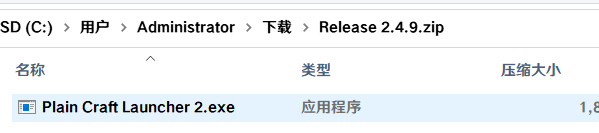

将**Plain Craft Launcher 2.exe**复制到新的文件夹里（**不要在压缩包里打开**）

在新文件夹中打开**Plain Craft Launcher 2.exe**，切换到下载选项卡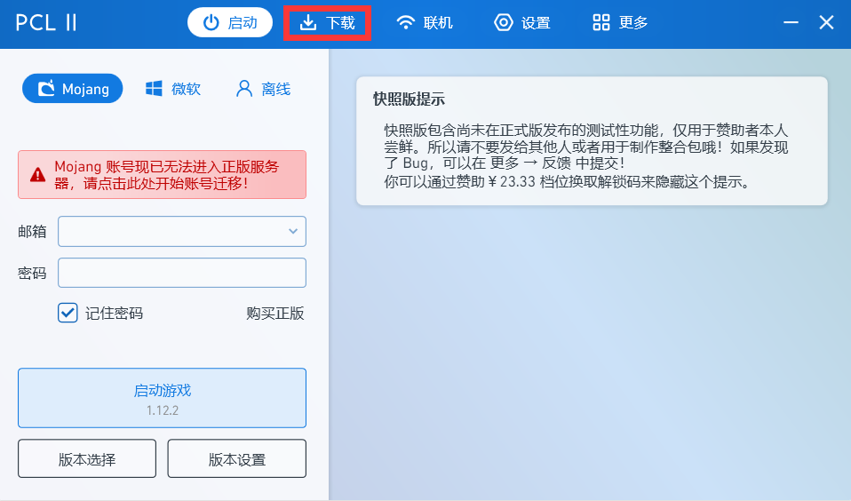

选择**正式版1.19.3**下载
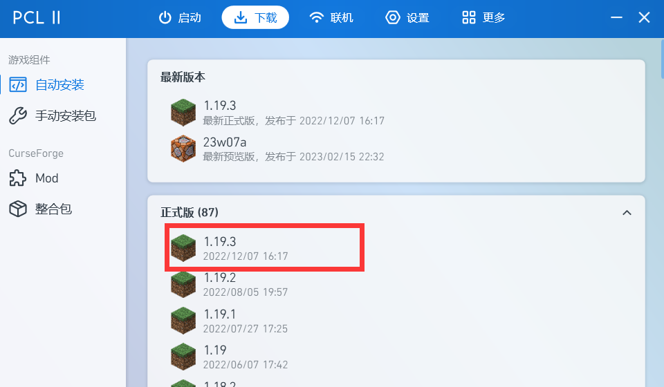
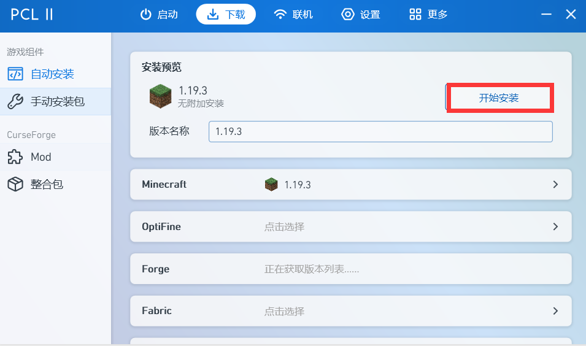

登录皮肤站，启动游戏
-
下载完成后，回到**启动**选项卡，打开**版本设置**（如果启动游戏下面显示的版本不是1.19.3，先点版本选择按钮切换版本）
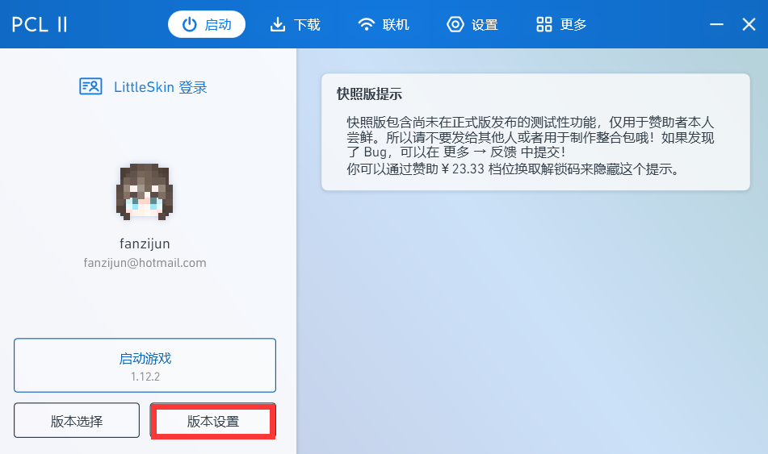

点击设置，在最下面的**服务器**中选择**第三方登录**，并且**设置为LittleSkin**
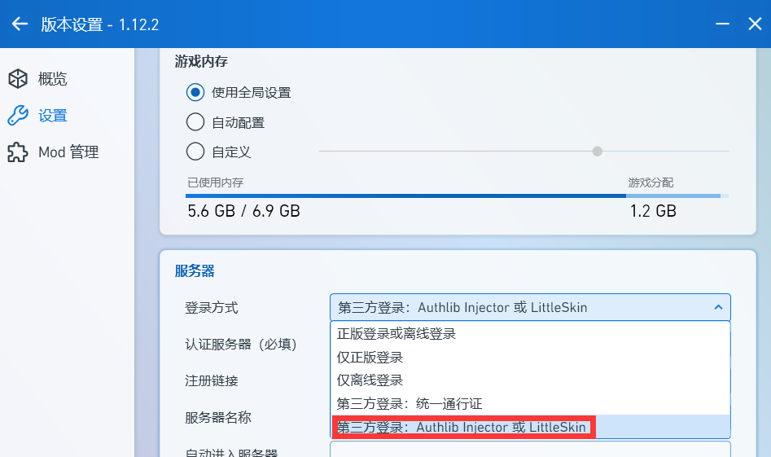
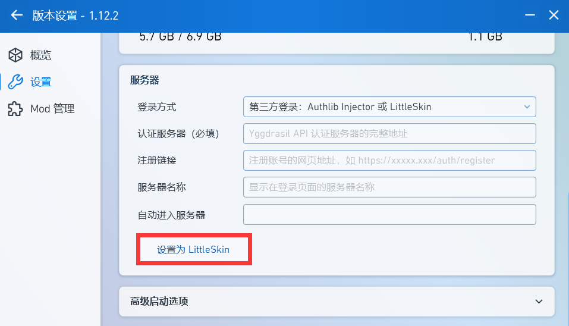

回到**启动**选项卡，登录你的皮肤站账号，点击**开始游戏**
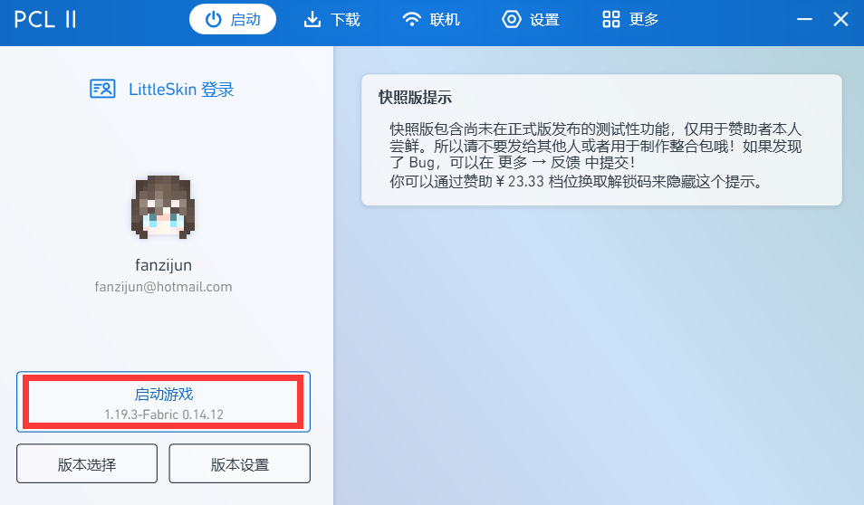

加入服务器
-
游戏加载完成后，点击多人游戏
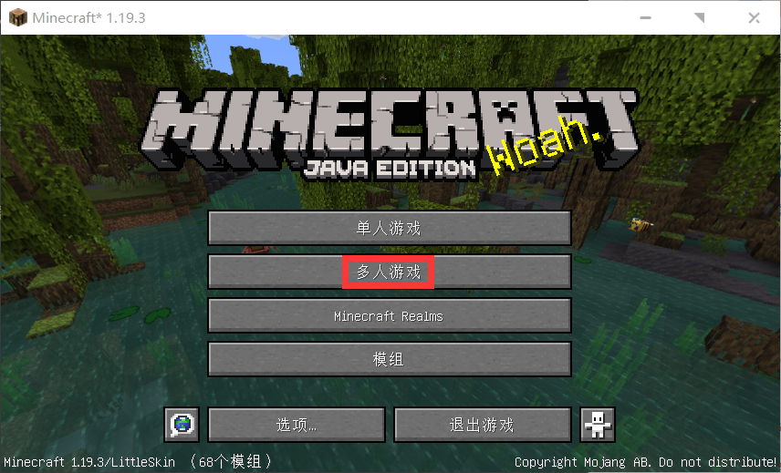

点击**添加服务器**，服务器名称可随意填写，服务器地址请填写**mc.forzencat.top**,将**服务器资源包**调整至**启用**,点击完成
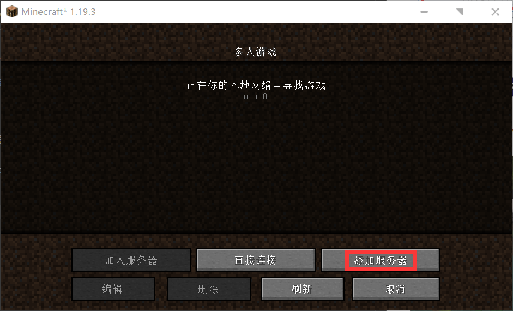
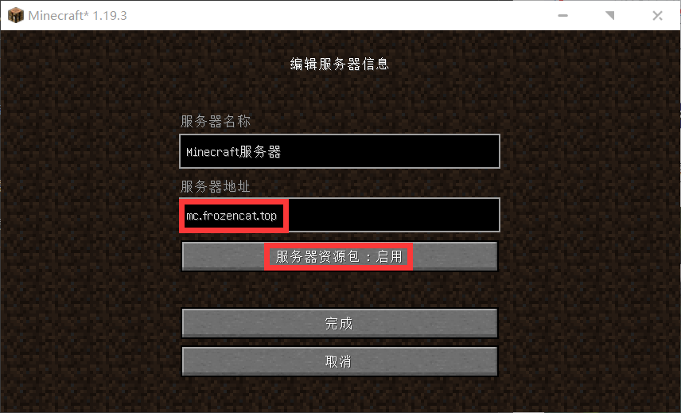

双击即可进入（如果无法连接到服务器，请刷新几次或者在群里询问）
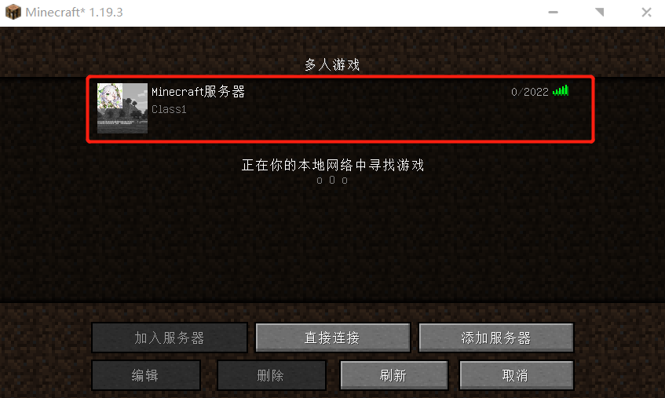
